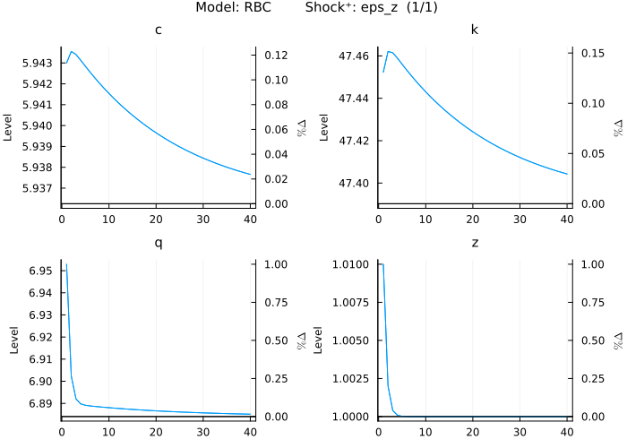

# Summary

`MacroModelling.jl` is a Julia [@Bezanson:2012] package for developing and solving dynamic stochastic general equilibrium (DSGE) models. These kind of models describe the behavior of a macroeconomy and are particularly suited for counterfactual analysis (economic policy evaluation) and exploring / quantifying specific mechanisms (academic research). Due to the complexity of these models, efficient numerical tools are required, as analytical solutions are often unavailable. `MacroModelling.jl` serves as a tool for handling the complexities involved, such as forward-looking expectations, nonlinearity, and high dimensionality.

The goal of this package is to reduce coding time and speed up model development by providing functions for working with discrete-time DSGE models. The user-friendly syntax, automatic variable declaration, and effective steady state solver facilitate fast prototyping of models. The package includes several pre-defined models from prominent economic papers, providing an immediate starting point for users.

The package supports programmatic model definition. Once the model is defined the package finds the solution for the model dynamics knowing only the model equations and parameter values. The model dynamics can be solved for using first, second, and third-order perturbation solutions [@villemot2011solving; @levintal2017fifth] using symbolic and automatic differentiation. Furthermore, the package can be used to calibrate parameters, match model moments, and estimate the model on data using the Kalman filter [@durbin2012time]. The package is designed to be user-friendly and efficient. Once the functions are compiled and the non-stochastic steady state (NSSS) has been found the users benefit from fast and convenient functions to generate outputs or change parameters.

# Example

One relatively simple example to study with the package is a real business cycle model (see e.g. [@kydland_and_prescott_1982]). The model describes the dynamics of an economy with households consuming a consumption good `c`, produced by competitive firms using the capital stock `k`, and an exogenous technology process `z`. The households maximize their utility (`log(c)`) and decide whether to invest in the capital stock or consume and the firms maximize their profits while minimizing their costs when deciding the amount of production inputs and quantity of output. The capital stock depreciates by the factor `δ` and the production technology takes the form: `k^α`. All agents discount the future with `β` and the exogenous AR(1) technology process is governed by parameters `ρ` and `σ_z`. Given the two optimization problems one can write down the optimality conditions (first-order conditions) as follows:

```julia
using MacroModelling
import StatsPlots

@model RBC begin
    1 / c[0] = (β / c[1]) * (α * z[1] * k[0]^(α - 1) + (1 - δ))
    c[0] + k[0] = (1 - δ) * k[-1] + q[0]
    q[0] = z[0] * k[-1]^α
          z[0] = (1 - ρ) + ρ * z[-1] + σ_z * eps_z[x]
end

@parameters RBC begin
    σᶻ = 0.01
    ρ  = 0.2
    δ  = 0.02
    α  = 0.5
    β  = 0.95
end

plot_irf(RBC)
```


The plot shows both the level, percent deviation from the NSSS as well as the NSSS itself. Note that the code to generate the impulse response function (IRF) plot contains only the equations, parameter values, and the command to plot.

# Comparison with other packages

`MacroModelling.jl` differentiates itself among macroeconomic modelling packages by offering a unique blend of capabilities and conveniences, such as automatic declaration of variables and parameters, automatic differentiation with respect to parameters, and support for perturbation solution orders up to 3. While it operates within the Julia environment, it presents an alternative to the MATLAB-dominated field, which includes [dynare](https://www.dynare.org), [RISE](https://github.com/jmaih/RISE_toolbox), [Taylor Projection](https://sites.google.com/site/orenlevintal/taylor-projection), [NBTOOLBOX](https://github.com/Coksp1/NBTOOLBOX/tree/main/Documentation), and [IRIS](https://iris.igpmn.org), the latter two being capable of providing only 1st order perturbation solutions.

Other Julia-based packages such as [DSGE.jl](https://github.com/FRBNY-DSGE/DSGE.jl), [StateSpaceEcon.jl](https://bankofcanada.github.io/DocsEcon.jl/dev/), [SolveDSGE.jl](https://github.com/RJDennis/SolveDSGE.jl), and [DifferentiableStateSpaceModels.jl](https://github.com/HighDimensionalEconLab/DifferentiableStateSpaceModels.jl) have functionalities similar to those of `MacroModelling.jl`. However, the former are not as general and convenience focused as the MATLAB packages and `MacroModelling.jl`. The Julia-based packages are missing convenience functionalities such as automatic creation of auxiliary variables for variables in lead and lag larger than 1, or programmatic model definition. These functionalities are convenient to the user but require significant effort to implement in the parser. Furthermore, the other Julia-based packages do not possess the unique feature set of `MacroModelling.jl` regarding variable declaration and automatic differentiation. Notably, the Python-based [dolo.py](https://www.econforge.org/dolo.py/) offers global solutions, but does not include estimation and balanced growth path features which are available in `MacroModelling.jl`.

`MacroModelling.jl` stands out as one of the few packages that can solve non-stochastic steady states symbolically, a feature shared only with [gEcon](http://gecon.r-forge.r-project.org), an R-based package. When, as in most cases, symbolic solution is not possible `MacroModelling.jl` uses symbolic simplification, search space transformation, automatic domain restrictions, restarts with different initial values, warm starts using previous solutions, and Levenberg-Marquardt type optimizer. The combination of these elements makes it possible to solve all 16 models currently implemented in the examples out-of-the box. This is remarkable because all other packages rely either on NSSS derivation by hand or a subset of the features outlined above and are in general far less reliable in finding the NSSS without further information (e.g. close enough initial guess). Furthermore, unlike many of its competitors, the domain specific model language of `MacroModelling.jl` is integrated into the Julia language, which makes for convenient reading and coding, with the help of Julia macros.

# Acknowledgements

The author wants to thank everybody who opened issues, reported bugs, contributed ideas, and was supportive in driving `MacroModelling.jl` forward.

# References
